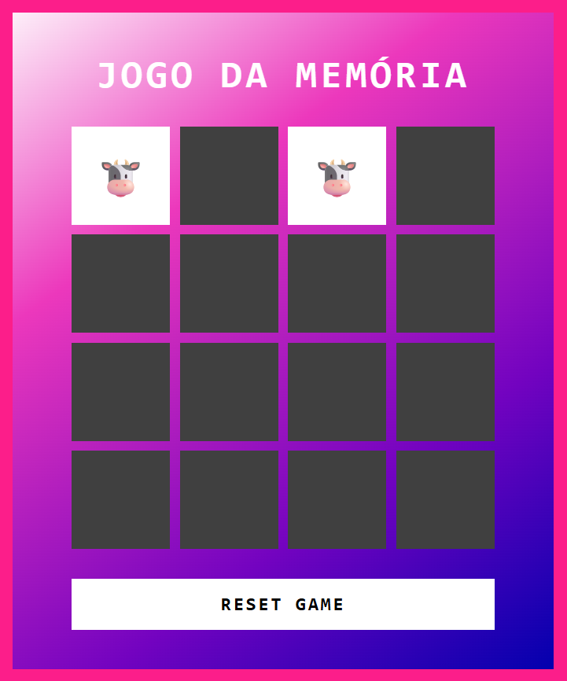

# Jogo Da Memoria Com Emojis

Bem vindo(a) ao resultado do meu segundo desafio na Trilha de Lógica de programação da DIO! Onde construí um jogo da memória com HTML, CSS, Javascript e o teclado de emojis do Windows.

Também deixei o jogo com um design mais responsivo, permitindo que seja utilizado tanto em aparelhos desktop quanto em aparelhos mobile. 

[Clique aqui](https://htolentino.github.io/JogoDaMemoriaComEmojis/) para acessar o resultado final da página criada por mim a partir do desafio da DIO!

